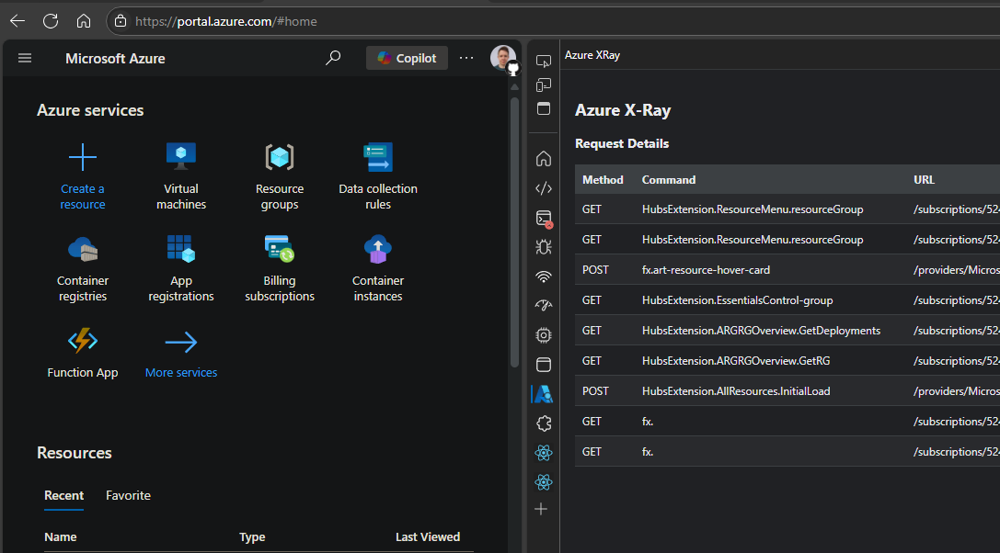
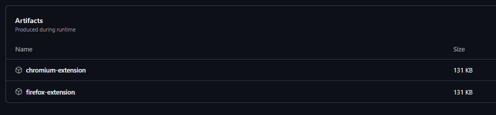

# Azure X-Ray

Azure X-Ray is a Browser Devtools Panel extension that enables you to see Azure Management REST API calls made by the Azure Portal.

Inspired by [Graph X-Ray](https://graphxray.merill.net/)

## Quick Start

Availability in the various extension stores is pending.

To use the development version:

1. Download the zip package from the [build you are interested in](https://github.com/JustinGrote/azure-xray/actions).

1. Extract the zip and then follow the sideloading instructions for your particular browser.
 [Google Chrome](https://developer.chrome.com/docs/extensions/get-started/tutorial/hello-world#load-unpacked)
 [Microsoft Edge](https://learn.microsoft.com/en-us/microsoft-edge/extensions-chromium/getting-started/extension-sideloading)
 [Mozilla Firefox](https://developer.mozilla.org/en-US/docs/Mozilla/Add-ons/WebExtensions/Your_first_WebExtension#installing) - Not Tested

## Develoment

Built with:
- [Vite](https://vite.dev/)
- [Mantine React](https://mantine.dev/)
- [Mantine Datatable](https://icflorescu.github.io/mantine-datatable/)
- [Github Copilot Edits](https://code.visualstudio.com/docs/copilot/copilot-edits)
