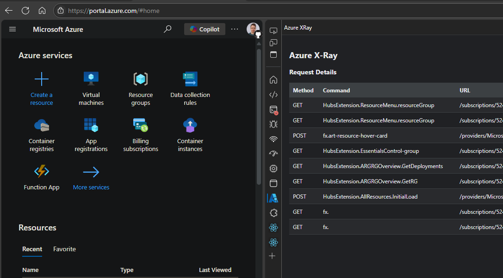
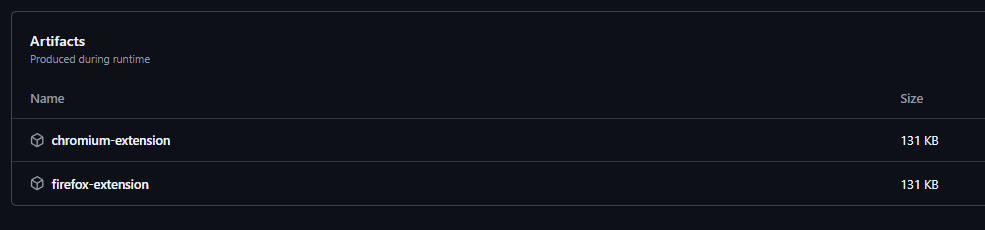

# Azure X-Ray

Azure X-Ray is a Browser Devtools Panel extension that enables you to see Azure Management REST API calls made by the Azure Portal.



Inspired by [Graph X-Ray](https://graphxray.merill.net/)

## Quick Start

Availability in the various extension stores is pending.

To use the development version:

1. Download the zip package from the commit you are interested in.


1. Extract the zip and then follow the sideloading instructions for your particular browser.
<br />[Google Chrome](https://developer.chrome.com/docs/extensions/get-started/tutorial/hello-world#load-unpacked)
<br />[Microsoft Edge](https://learn.microsoft.com/en-us/microsoft-edge/extensions-chromium/getting-started/extension-sideloading)
<br />[Mozilla Firefox](https://developer.mozilla.org/en-US/docs/Mozilla/Add-ons/WebExtensions/Your_first_WebExtension#installing) - Not Tested

## Development

Built with [Plasmo](https://docs.plasmo.com/) and [Copilot Edits](https://code.visualstudio.com/docs/copilot/copilot-edits)

First, run the development server:

```bash
pnpm dev
# or
npm run dev
```

Open your browser and load the appropriate development build. For example, if you are developing for the chrome browser, using manifest v3, use: `build/chrome-mv3-dev`.

For further guidance, [visit the Plasmo Documentation](https://docs.plasmo.com/)